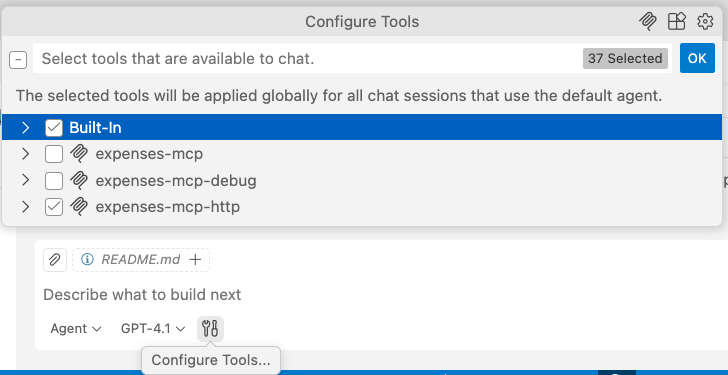
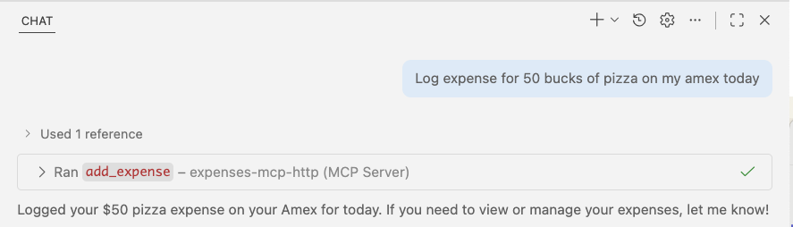

# Python MCP Demo

Una demo para mostrar implementaciones del Model Context Protocol (MCP) usando FastMCP, con ejemplos de transporte stdio y HTTP, y integración con LangChain y Agent Framework.

## Tabla de contenidos

- [Requisitos](#requisitos)
- [Setup](#setup)
- [Scripts en Python](#scripts-en-python)
- [Configuración del servidor MCP](#configuracion-del-servidor-mcp)
- [Debugging](#debugging)

## Requisitos

- Python 3.13 o superior
- [uv](https://docs.astral.sh/uv/)
- Acceso a una API de uno de los siguientes proveedores:
  - GitHub Models (token de GitHub)
  - Azure OpenAI (credenciales de Azure)
  - Ollama (instalación local)
  - OpenAI API (API key)

## Setup

1. Instala dependencias usando `uv`:

   ```bash
   uv sync
   ```

2. Copia `.env-sample` a `.env` y configura tus variables de entorno:

   ```bash
   cp .env-sample .env
   ```

3. Edita `.env` con tus credenciales. Selecciona el proveedor definiendo `API_HOST`:
   - `github` - GitHub Models (requiere `GITHUB_TOKEN`)
   - `azure` - Azure OpenAI (requiere credenciales de Azure)
   - `ollama` - Instancia local de Ollama
   - `openai` - OpenAI API (requiere `OPENAI_API_KEY`)

## Scripts en Python

Ejecuta cualquier script con: `uv run <script_path>`

- **servers/basic_mcp_http.py** - Servidor MCP con transporte HTTP en el puerto 8000
- **servers/basic_mcp_stdio.py** - Servidor MCP con transporte stdio para integración con VS Code / Copilot
- **agents/langchainv1_http.py** - Agente LangChain con integración MCP
- **agents/langchainv1_github.py** - Demo de filtrado de herramientas LangChain con GitHub MCP (requiere `GITHUB_TOKEN`)
- **agents/agentframework_learn.py** - Integración con Microsoft Agent Framework y MCP

## Configuración del servidor MCP

### Usando MCP Inspector

El [MCP Inspector](https://github.com/modelcontextprotocol/inspector) es una herramienta para interactuar con y depurar MCP servers.

> Nota: Aunque técnicamente los servidores HTTP pueden funcionar con port forwarding en Codespaces o Dev Containers, armar el Inspector + adjuntar el debugger puede ser complicado. Para una experiencia más simple y completa con debugging, lo mejor es correr el proyecto localmente.

**Para servidores stdio:**

```bash
npx @modelcontextprotocol/inspector uv run servers/basic_mcp_stdio.py
```

**Para servidores HTTP:**

1. Corre el servidor HTTP:

   ```bash
   uv run servers/basic_mcp_http.py
   ```

2. En otra terminal, corre el inspector:

   ```bash
   npx @modelcontextprotocol/inspector http://localhost:8000/mcp
   ```

El Inspector te da una interfaz web para:
- Ver las herramientas (tools), recursos y prompts disponibles
- Probar llamadas a tools con parámetros personalizados
- Inspeccionar respuestas y errores del servidor
- Debuggear la comunicación con el servidor

### Usando con GitHub Copilot

El archivo `.vscode/mcp.json` configura servidores MCP para la integración con GitHub Copilot:

**Servidores disponibles:**

- **expenses-mcp**: servidor con transporte stdio para uso normal
- **expenses-mcp-debug**: servidor stdio con debugpy en el puerto 5678
- **expenses-mcp-http**: servidor HTTP en `http://localhost:8000/mcp`. Tenés que iniciarlo manualmente con `uv run servers/basic_mcp_http.py` antes de usarlo.

**Cambiar servidores:**

En el panel de Chat de GitHub Copilot, abrí el ícono de herramientas y elegí el servidor MCP que quieras usar.



**Ejemplo de entrada**

Usá una consulta como esta para probar el servidor de gastos MCP:

```
Registrá un gasto de 50 dólares de pizza en mi Amex hoy
```



## Debugging

El archivo `.vscode/launch.json` incluye una configuración de depuración:

**Attach to MCP Server (stdio)**: Se adjunta al servidor iniciado mediante `expenses-mcp-debug` en `mcp.json`.

Para depurar un servidor MCP con GitHub Copilot Chat:

1. Colocá breakpoints en el código del servidor MCP en `servers/basic_mcp_stdio.py`.
2. Iniciá el servidor de depuración a través de la configuración `expenses-mcp-debug` en `mcp.json`.
3. Presioná `Cmd+Shift+D` para abrir Run and Debug.
4. Elegí la configuración "Attach to MCP Server (stdio)".
5. Presioná `F5` o el botón de play para iniciar el debugger.
6. En las herramientas del chat de GitHub Copilot, seleccioná el servidor `expenses-mcp-debug`.
7. Usá GitHub Copilot Chat para invocar las tools MCP.
8. El debugger se detendrá en los breakpoints.
